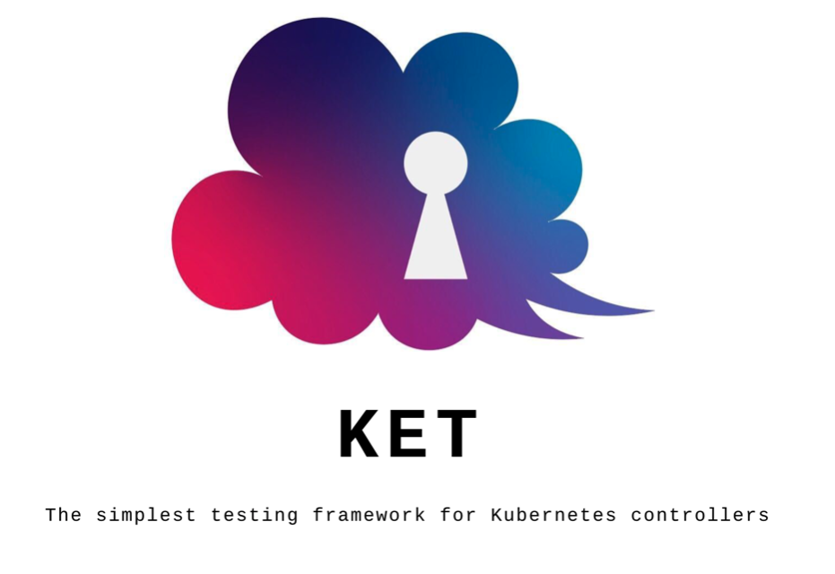

# 

# KET(Kind E2e Test framework)

KET is the simplest testing framework for Kubernetes controller.
KET is available as open source software, and we look forward to contributions from any engineers.

## Introduction

The goal of KET is to help you build what you need to test your Kubernetes Controller.
It is an open platform that allows developers to focus only on the responsibilities of the controller, without worrying about the complexities of running a cluster, building resources, and events that make the Reconciliation Loop work.

KET has following feature.

- create **kind** cluster
- Provide **Build and Deploy** pipelines using Skaffold
- The necessary client tools include **client-go and kubectl**
- Reproduce declarative resource state, i.e., **kubectl apply -f**

KET is composed of these components:

- <a href="https://kind.sigs.k8s.io/">Kind</a>
- <a href="https://skaffold.dev/">Skaffold</a>
- <a href="https://kubernetes.io/docs/reference/kubectl/overview/">kubectl</a>
- <a href="https://github.com/kubernetes/client-go">client-go</a>

## Example

### Setup for e2e testing

If you want to do E2E (end to end) testing against your Kubernetes controller.

We recommend you to build a cluster environment using TestMain.

```go
import (
	"context"
	"fmt"
	"os"
	"testing"

	"github.com/riita10069/ket/pkg/setup"
	"k8s.io/apimachinery/pkg/types"
)

func TestMain(m *testing.M) {
	os.Exit(func() int {
		ctx := context.Background()
		ctx, cancel := context.WithCancel(ctx)
		defer cancel()

		cliSet, err := setup.Start(
			ctx,
			setup.WithBinaryDirectory("./_dev/bin"),
			setup.WithKindClusterName("ket-controller"),
			setup.WithKindVersion("0.11.0"),
			setup.WithKubernetesVersion("1.20.2"),
			setup.WithKubeconfigPath("./.kubeconfig"),
			setup.WithCRDKustomizePath("./manifest/crd"),
			setup.WithUseSkaffold(),
			setup.WithSkaffoldVersion("1.26.1"),
			setup.WithSkaffoldYaml("./manifest/skaffold/skaffold.yaml"),
		)
		if err != nil {
			fmt.Fprintf(os.Stderr, "failed to setup kind, kubectl and skaffold: %s\n", err)
			return 1
		}

		kubectl := cliSet.Kubectl
		_, err = kubectl.WaitAResource(
			ctx,
			"deploy",
			types.NamespacedName{
				Namespace: "CONTROLLER_NAMESPACE",
				Name:      "CONTROLLER_NAME",
			},
		)
		if err != nil {
			fmt.Fprintf(os.Stderr, "failed to wait resource: %s\n", err)
			return 1
		}

		return m.Run()
	}())
}
```

`setup.Start()`function builds the testing environment.

### context.Context

`setup.Start` will start one or more goroutines.
It is desirable to give a context that will be canceled() at the end of the test.

### WithBinaryDirectory

Save the binary, e.g. kubectl, in the specified directory.
By default, `. /bin` is used.

### WithKindClusterName

You can specify the name of the Kind cluster.
By default, `ket` is used.

### WithKubeconfigPath

It is possible to change the PATH of kubeconfig.
The default is to use `$HOME/.kube/config`.

Please see below for details.
https://kubernetes.io/docs/concepts/configuration/organize-cluster-access-kubeconfig/

### WithCRDKustomizePath

The CRD resources used by the controller are Apply using <a href="https://github.com/kubernetes-sigs/kustomize">kustomize</a>。

The path to kustomize.yaml should be given here.
If you do not use this option, the resource will not be applied.
If you don't need a CRD, you should.

### WithUseSkaffold

If this is not used, the controller will not run on the cluster.
If you want to use a build with Skaffold, make sure to give this option explicitly.
If you want the controller to be built directly using the local Go environment, you do not need to use this option.

### WithSkaffoldYaml

If you use `WithUseSkaffold()`, use it.
This will specify the PATH to <a href="https://skaffold.dev/docs/references/yaml/">skaffold.yaml</a>.

## clientSet

The return value of the setup.Start() function is the ClientSet struct.

```go
type ClientSet struct {
	ClientGo *k8s.ClientGo
	Kubectl  *kubectl.Kubectl
	Kind     *kind.Kind
	Skaffold *skaffold.Skaffold
}
```


Start() function is a ClientSet struct, from which you can use the commands you need in your test logic.

## kubectl

### ApplyKustomize, ApplyFile

ApplyKustomize, ApplyFile will execute `kubectl apply -k` and `kubectl -f`.

Also, `ApplyAllManifest` will apply all files by passing the path of the file as an array.
By including this code at the beginning of the test case, declarative resource management using yaml files becomes possible.

```go
kubectl.ApplyAllManifest(ctx, tt.fixture.manifestPaths, false)
```

To avoid affecting the next case, make sure to delete the created resource at the end of the case as follows

```go
kubectl.DeleteAllManifest(ctx, tt.fixture.manifestPaths, true)
```

Also, resources created by other things such as Controller can be explicitly deleted as follows.

```go
kubectl.DeleteResource(ctx, "ket", "ket-namespace", "pod")
```

The fourth argument gives the name of the resource to be deleted.
The name of the resource must be of type string according to the following table.
https://kubernetes.io/ja/docs/reference/kubectl/_print/#resource-types


### WaitAResource

This is a command that waits for a resource to be created.
The name of the resource must be of type string according to the following table.
https://kubernetes.io/ja/docs/reference/kubectl/_print/#resource-types

Also, when the resource is a Pod or a Deployment, it will continue to wait until it is not only created but also has a Status of Ready.
Please note that ReplicaSet and DaemonSet are not supported yet.

## verify using kubectl

It is more versatile to use cllient-go.
However, I felt that there is merit in intuitive operation using kubectl, so I created some methods.


### GetNamespacesList

You can get a list of Namespaces that exist in the cluster.


### GetResourceNameList

You can get a list of Names of resources in a specific Namespace.

## Kind

### Create Cluster

You can create a kind cluster.

### Delete Cluster

ifyou use this method, You can also delete the kind cluster at the end of the test.


## Self-created commands

On KET, it is too simple and instantaneous to methodize the command you want to execute.

The KET API provided is still poor.
However, you can use your own commands to do the operations you want to do.
And I am very much looking forward to your contributions as well.

Suppose you want to use the command `kubectl get all --all-namespaces -o=jsonpath='{.items[*].metadata.name}` as a method in your test.

What we need to do to execute the kubectl command is to implement it as a method of the kubectl struct.
It is very easy to provide arguments to the command. We just need to create an array.

You can do this as follows

```go
func (k *Kubectl) AllResourcesNameList(ctx context.Context) (string, error) {
	args := []string{"get", "all", "--all-namespaces", "-o=jsonpath='{.items[*].metadata.name}'"}
	stdout, _, err := k.Capture(ctx, args)
	if err != nil {
		return nil, err
	}
	
	return stdout, nil
}
```

This is the only way to receive the output.
If you do not need to receive the output, use Execute instead of Capture.
